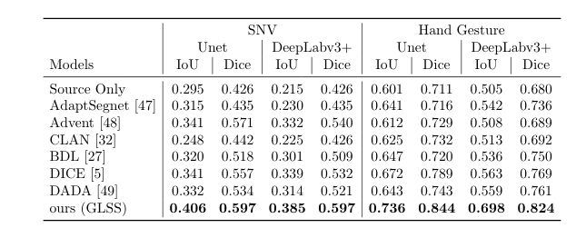

# Skin Segmentation from NIR Images using Unsupervised Domain Adaptation through Generative Latent Search
Tensrflow Implementation of our method  to transfer the bias from the source to the target domain. The latent space of a generative model, learnt on the source domain, is employed to find the "clones" for the target samples. As the "clones" are sampled from the source distribution, an oracle segmentation model learnt only on source, will interpret these "clones" of target samples in a better way, thereby reducing the domain shift. The proposed method guarantees to reduce the shift.

## Paper
'Skin Segmentation from NIR Images using Unsupervised Domain Adaptation through Generative Latent Search'.
Accepted in ECCV2020 (Spotlight). 
Preprint: https://arxiv.org/abs/2006.08696


## Example Results


## Quantitative Results
<p align="center">
  
</p>

## Download dataset
Kindly fill the form to download the dataset 
https://forms.gle/y5vPeyT6zi9gdqD57
On filling the form, the datasets namely SNV dataset and Hand Gesture dataset will be shared by email.

## Requirements 
- tensorflow = 1.14.0
- python = 3.6
- keras = 2.2.5


## Preprocessing 
Image were reshaped to 128x128 dimension and normalized between -1 to 1. 

## Training 

Train segmentation network on the source domain 
```
python u_efficientnet.py
```

To train VAE and Perfom Latent search on Target domain. 
```
python vae_u-efficientnet_latent_search.py
```
To Train Vae with Perceptual loss with Deeplabs

```
python vae_DeepLabs-frez--PL-LS.py
```

## Cite
```
@article{pandey2020skin,
  title={Skin Segmentation from NIR Images using Unsupervised Domain Adaptation through Generative Latent Search},
  author={Pandey, Prashant and Tyagi, Aayush Kumar and Ambekar, Sameer and AP, Prathosh},
  journal={arXiv preprint arXiv:2006.08696},
  year={2020}
}
```


